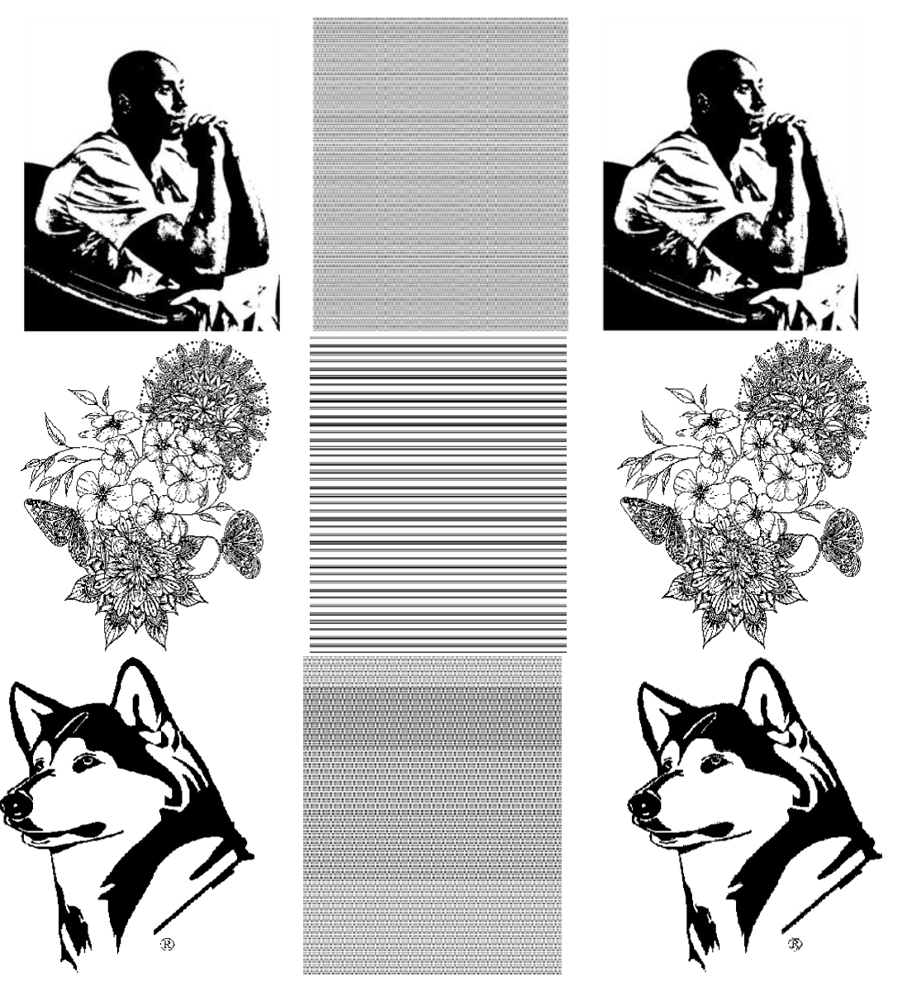

<!-- <a href="url" style="color:add_color">
    This becomes hyper link with a different color.</a> -->

 

 
Path Planning with Autonomous Obstacle Avoidance Using Reinforcement Learning for Six-axis Arms 

2020 IEEE International Conference on Networking, Sensing and Control (ICNSC), 2020, pp. 1-6. 

 
 

<!--Project 2-->
 

 
An UAV Wireless Communication Noise Suppression Method Based on OFDM Modulation and Demodulation

Radio Science, 55, e2019RS006959 

