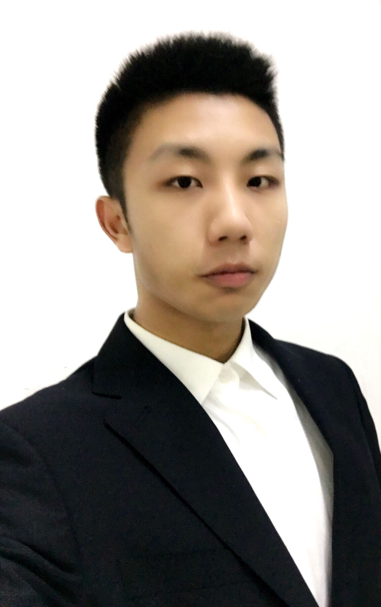

---
# Feel free to add content and custom Front Matter to this file.
# To modify the layout, see https://jekyllrb.com/docs/themes/#overriding-theme-defaults
layout: page
---
<!--Headings-->
<!--
Example of a paragraph with margin and padding.
-->
 

 
 
 
 

Yinsen Jia | 贾寅森 
yj2677@columbia.edu 
M.S. Student,
Department of Electrical Engineering 

Member,
Columbia Artificial Intelligence and Robotics (CAIR) 

 

 
 
 
 
I am a first-year M.S student in [Department of Electrical Engineering](https://www.engineering.columbia.edu/) at [Columbia University](https://www.columbia.edu/). I am interested in Robotic Learning, Deep Learning, Computer Vision and High DOF Planning. 

I have received Bachelor's degree of Electrical and Automation Engineering from [Nanjing Normal University](https://www.njnu.edu.cn/)(2020), and was a short-term student at [Rice University](https://www.rice.edu/)(2021). Now I am studying in Columbia University and expecting to graduate in 2023.

I have been the research assistant student in Robot Learning and Control Group of Nanjing University, posting and oral presenting my work on [IEEE ICNSC conference](http://www.icnsc2020.org/). I was also the research leader of UAV denoising communication link group in Jiangsu Electromagnetic Compatibility Engineering. I am now the member of [CAIR]((https://cair.cs.columbia.edu/)) Lab guided by Professor [Shuran Song](https://www.cs.columbia.edu/~shurans/) and Ph.D. [Jingxi Xu](https://jxu.ai/).

---
 

## HighLights

